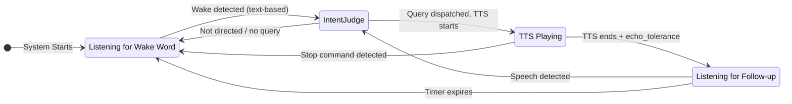

# Listening Flow Specification v2

This document outlines the voice listening architecture. The system uses a **transcript-first** approach where speech is continuously transcribed, and an LLM intent judge extracts queries with full context.

## Architecture Overview

```
┌─────────────────────────────────────────────────────────────────┐
│                         Audio Stream                            │
└───────────────────────────┬─────────────────────────────────────┘
                            │
            ┌───────────────┼───────────────┐
            ▼               ▼               ▼
┌───────────────┐                  ┌───────────────┐
│     VAD       │                  │   TTS Output  │
│ (speech gate) │                  │   Tracking    │
└───────┬───────┘                  └───────────────┘
        │
        ▼
┌───────────────┐
│    Whisper    │
│ (transcribe)  │
└───────┬───────┘
        │
        ▼
┌───────────────────────────────────────┐
│     Rolling Transcript Buffer         │
│     (2 minutes, with timestamps)      │
│                                       │
│  Segments include:                    │
│  - text, start_time, end_time         │
│  - energy level                       │
│  - is_during_tts flag                 │
└───────────────────┬───────────────────┘
                    │
                    ▼ (on wake detection)
┌───────────────────────────────────────┐
│          Intent Judge LLM             │
│        (gemma4 or main)          │
│                                       │
│  Inputs:                              │
│  - Transcript buffer (recent)         │
│  - Wake word timestamp (if any)       │
│  - Last TTS text + finish time        │
│  - Current state                      │
│                                       │
│  Outputs:                             │
│  - directed: bool                     │
│  - query: "extracted clean query"     │
│  - stop: bool                         │
│  - confidence: high/medium/low        │
│  - reasoning: "brief explanation"     │
└───────────────────┬───────────────────┘
                    │
                    ▼
┌───────────────────────────────────────┐
│           Reply Engine                │
└───────────────────────────────────────┘
```

## Key Design Principles

### 1. Transcript-First

Instead of extracting post-wake-word audio, we:
- Continuously transcribe all speech (VAD-gated)
- Store transcripts with timestamps in a rolling buffer
- Let the intent judge extract the relevant query

**Benefits:**
- Pre-wake-word chatter naturally filtered: "blah blah Jarvis what time is it" → "what time is it"
- Full context available for intent understanding
- Echo detection via multi-layer approach (fuzzy text matching + LLM intent judge)

### 2. Text-Based Wake Detection

Wake word detection operates on the rolling transcript buffer. When Whisper produces text, it is checked for the configured wake word and aliases using fuzzy matching (`rapidfuzz`). This supports arbitrary wake words in any language.

### 3. Context-Aware Intent Judge

The intent judge receives full context and makes intelligent decisions:
- Knows what TTS said → can identify echo vs real speech
- Sees pre-wake-word context → can understand "...what do YOU think, Jarvis?"
- Extracts clean query → removes filler words, false starts

**Gating:** The judge is called only when there is an engagement signal — (a) a wake word was detected in the current utterance, (b) the utterance falls inside (or pending) a hot window, or (c) TTS is currently speaking. Pure ambient speech skips the judge entirely. This keeps the synchronous audio loop from blocking up to `intent_judge_timeout_sec` on every background utterance, which would otherwise freeze the UI when Ollama is slow or contended.

**Alias normalisation:** Before the transcript is sent to the judge, every configured wake-word alias in each segment is replaced with the primary assistant name (case-insensitive, word-boundary-aware). Aliases are Whisper mishearings of the wake word (e.g. "Jervis", "Jaivis" for "Jarvis"); without this step the small judge model sees the alias, doesn't know it refers to the assistant, and can decide the user is addressing a different person. Normalisation happens at prompt-build time only — the raw transcript buffer is untouched.

**Wake-word removal in the extracted query:** The wake word is addressed TO the assistant, never part of the query content. The judge prompt explicitly instructs removing every occurrence of the wake word from the extracted `query` — at the start, end, or middle of the sentence, including when it sits next to a named entity (e.g. "movie called Possessor Jarvis" → film is "Possessor", not "Possessor Jarvis"). The only exception is when the user is literally talking *about* the assistant as a subject ("tell me about Jarvis"). This is enforced by prompt rule + example rather than post-hoc string stripping, because the LLM already understands the semantic distinction and can handle cases a regex would mishandle (e.g. proper names that contain the wake word, like "Jarvis Cocker").

**Model residency (`keep_alive: 30m`):** Each intent-judge request asks Ollama to keep the model resident for 30 minutes after the call. This avoids cold reloads between utterances — without it, Ollama evicts the model after its default 5-minute idle window and the next judge call pays the full reload cost (seconds of extra latency), which is long enough to hit `intent_judge_timeout_sec` and abort. The trade-off is memory: the judge model (default `gemma4:e2b`, ~2 GB) stays resident in RAM/VRAM during active voice sessions. On memory-constrained devices the user can switch to a smaller judge model or override `keep_alive` via a custom Ollama setup.

## Startup & Model Warmup

Before the listener announces "Listening!", it pre-loads every model the first engagement will need. All warmup output is grouped under a single `🔥 Warming up models...` header with indented child status lines, e.g.

```
  🔥 Warming up models...
     🎤 Whisper 'small' loaded on cpu
     💬 Chat model 'llama3.1' ready
     🧠 Intent judge 'gemma4:e2b' ready
🎙️  Listening! Try:
      "How's the weather, Jarvis?"          ← when location is known
      "How's the weather in [your city], Jarvis?"  ← when location is disabled or not configured
      "I just ate a Big Mac, Jarvis."
      "What are you thinking, Jarvis?"
      "What do you know about me, Jarvis?"
```

Warmup covers chat, the intent judge, and (when `tool_selection_strategy == "llm"`) the tool router, de-duplicated when roles share a model. **When `vision_enabled` is true the vision model (`vision_model`, e.g. `qwen2.5vl:3b`) is also warmed** (`warmup-vision` thread, skipped if it shares an already-warmed model). This is so the first `seeScreen` hits a resident model: under VRAM contention a cold vision load + image eval can exceed the per-call `vision_timeout_sec`, which otherwise surfaces as "the vision system is taking a long time to wake up" on the first ask after boot. All warmups are best-effort, parallel, and joined under a shared deadline before "Listening!".

The weather example adapts to location availability: if `location_enabled` is true, a location source is configured (`location_auto_detect` or a manual `location_ip_address`), **and** the GeoLite2 database is present (`is_location_available()` returns true), the plain form is shown; otherwise the `[your city]` placeholder form is shown so the user understands they must substitute a real city name in their query.

On small models, a caveat line is appended above a more involved example to set expectations (`⚠️ Small model in use (…). Assume it can't infer — spell out the steps for anything more involved:`). The Chrome MCP tip continues to appear as its own block when the browser tool is detected.

**What gets warmed:**
- **Whisper** — loading the model; additionally a silent-audio transcribe so the first real utterance doesn't pay the cold-decode cost. Both the MLX and faster-whisper backends do this.
- **Chat model** (`cfg.ollama_chat_model`) — a minimal Ollama `/api/generate` request with `keep_alive=30m` so the weights stay resident.
- **Intent judge model** (`cfg.intent_judge_model`) — same pattern. If it points at the same Ollama model as the chat model, a single warmup covers both roles (Ollama loads the weights once).

**Concurrency:** LLM warmups run in daemon threads started before Whisper loads, so they overlap with Whisper initialisation. After Whisper finishes, the listener joins the warmup threads with a **single 60 s budget** shared across them all. If the budget is exhausted, the listener continues (with a `⏳ Some models still warming — continuing anyway` notice) and the first engagement pays the cold-load cost on demand.

**Best-effort semantics:** Every warmup path swallows its own errors and returns a bool. A failed warmup prints `⚠️ … warmup failed — will load on first use` but never blocks or crashes the listener — voice input is prioritised over startup latency.

## The Three Listening Modes

### 1. Wake Word Mode (Default)

System is waiting for wake word activation.

**Triggers:**
- Text-based detection finds wake word (or aliases) in transcript

**On trigger:**
1. Start thinking beep immediately and set face state to LISTENING
2. Wait for utterance to complete (user finishes speaking)
3. Send transcript buffer + wake timestamp to intent judge
4. If `directed=true` and `query` exists, dispatch to reply engine
5. If rejected, stop the beep and revert face state to IDLE

**Bare wake word (wake-ack):** when the utterance is JUST the wake word plus
filler/punctuation (`is_wake_only_utterance` — wake aliases stripped, no
remaining `\w{3,}` token, language-agnostic), it must NEVER reach the reply
engine. The user paused for an acknowledgement: the listener speaks
`wake_ack_text` (default "Yes, Boss?", canned — no LLM) and opens an
immediate listening window of `wake_ack_window_sec` (default 8s) via
`StateManager.activate_hot_window_now`, so the command spoken after the
pause is accepted without re-waking. This window is deliberately NOT gated
by `hot_window_enabled` (that flag governs post-REPLY follow-ups; here the
user explicitly summoned the assistant). Enforced at two layers: an early
short-circuit in the cascade (before any LLM call — the ack is instant) and
a safety net in `_dispatch_query` for tiers that echo the wake word back as
the extracted query. Live failure this encodes: "Hey Jarvis." was dispatched
as a chat query (fused call + ~20s rambling reply) and the real command,
spoken right after, arrived with no wake signal active and was dropped.

**Failure isolation (both STT backends):** an exception while PROCESSING one
transcript is caught at the call site, logged, and the utterance dropped —
it must never propagate into the backend loop or the bridge callback. At the
dispatcher level, a backend that crashes AFTER running past the fast-fail
window is restarted (same backend), never treated as a fatal startup failure.
Live failure this encodes: one NameError during a single utterance exited the
whole STT dispatcher thread; the assistant went permanently deaf, and later
backend-switch requests and the manual trigger talked to a dead thread.

**Fast-fail revert is runtime-only:** a backend that fails to START (returns
inside the fast-fail window — e.g. Wispr Flow app not running at boot) makes
the dispatcher fall back to the other backend **for the session only**. The
persisted `stt_backend` is the user's PREFERENCE and is never rewritten by a
failed start (user directive 2026-06-12: every restart must default to the
configured backend — the previous persist-on-revert silently flipped the
default to whisper forever after one bad boot). Explicit switches via the
console/Settings still persist normally through PATCH `/api/config`.

**Low-VRAM mode (console "Free VRAM" flush):** while `runtime_flags.
is_brain_paused()` is True, `_process_transcript` short-circuits at the very
top — NO LLM call may happen (not even the fused intent classifier), no state
machinery runs, and a non-empty utterance gets exactly one canned spoken
notice (`lowvram_notice_text`, Piper is CPU) so the assistant explains itself
instead of appearing broken. Empty/timeout ticks are silently ignored. The
flag is runtime-only (resets on daemon start — a restart always brings the
brain back); the daemon's diary check also skips while paused. CPU features
keep working: wake word, reminder firing, dictation via cloud STT, console.

### 2. Hot Window Mode

After TTS finishes, allow wake-word-free follow-up.

**Activation:** `echo_tolerance` seconds after TTS ends (allows echo to settle)

**Duration:** Configurable (default: 3 seconds)

**Behaviour:** Speech first passes through an early fuzzy echo check (rapidfuzz `partial_ratio`, threshold 70, with word-count guard to avoid catching mixed echo+speech). Pure echo is silently rejected **without calling the intent judge** — this keeps echo rejection instant and prevents it from blocking the audio loop. The hot window timer is **not** reset on echo rejection. Non-echo speech is sent to the intent judge, but if the judge rejects it, the rejection is overridden — all non-echo speech in the hot window is accepted as a follow-up query.

**Mixed echo+speech handling:** When Whisper merges TTS echo and user speech into one chunk (e.g. mic picks up TTS then user speaks), the word-count guard detects the extra content and lets it through to the intent judge. The judge extracts the user's actual query from the mixed transcript. Post-judge echo checks also use the word-count guard and verify the judge's extracted query isn't itself echo before rejecting.

**Early salvage for echo-prefixed follow-ups:** Before the early fuzzy check rejects a chunk as pure echo, the listener calls `cleanup_leading_echo` to strip any TTS-tail prefix. If exact-word cleanup fails (for example because Whisper mis-transcribed the first echo word — *"explores"* → *"laws"* — breaking the word-level comparison), the listener falls back to `salvage_after_echo_tail`, which scans heard-text word boundaries right-to-left looking for the rightmost 5-word window that fuzzy-matches the TTS tail (`partial_ratio >= 85`) and keeps everything after it. This preserves short follow-ups (*"Who made it?"*) that the existing fuzzy-prefix salvage would otherwise truncate by one word because it prefers the shortest suffix. If the surviving remainder has at least `EchoDetector.min_salvage_words` words (default 3), it replaces the transcript segment text and is treated as the user's follow-up. The same minimum-word threshold is shared by the during-TTS and post-TTS merged-chunk salvage paths so the policy is consistent across all three sites.

**Timestamp-based detection:** `was_speech_during_hot_window(utterance_start_time, utterance_end_time)` compares the utterance's time range against the hot window's time span (from schedule to expiry). This eliminates race conditions between slow Whisper transcription and the expiry timer — if the user started speaking during the window, it counts as hot window input regardless of when the transcript arrives. Also handles **overlapping utterances** where VAD triggered during TTS (mic picking up echo) but the utterance extended into the hot window period.

**`could_be_hot_window` (intent judge context):** Derived from timestamp comparison — returns True if the hot window is active, activation is pending, the utterance started within the window span even after expiry, or the utterance overlaps with the span (started before, ended during).

**Expiry:** Timer-based, guaranteed to fire even if no audio

### 3. During TTS

While TTS is playing, echo rejection and stop commands are handled with fast text-based checks (no LLM). This prevents self-loops where the mic picks up TTS output. After TTS finishes, the intent judge takes over.

**Stop detection:**
- Text-based: Check for "stop", "quiet", "shut up", etc.
- Intent judge can also detect stop commands

**Echo handling:**
- Transcripts during TTS are flagged with `is_during_tts=true`
- Intent judge uses this context to identify echo

**Wispr backend (openWakeWord push-to-talk) — two independent suspends:** wake detection is paused two separate ways, and they must NOT share a flag. A transient *speaking-pause* (`_speak_paused`) is raised while JARVIS talks and auto-lifted ~0.8 s after speech ends, so the echo tail can't false-trigger the wake model. The user *MUTE* from the HUD/control bus sets a distinct *user-mute* (`_user_muted`). The post-speak resume lifts only the speaking-pause, so a user MUTE survives JARVIS speaking (including autonomous spoken reminders) and is cleared solely by UNMUTE/TRIGGER. Collapsing both into one flag was the bug where mute stopped working after any TTS. **The wake model is fed EVERY frame** so its stateful classifier window stays continuously primed — openWakeWord needs ~1.3 s of consecutive frames before it scores a real wake, and gating the model on silence starved that window and tanked first-frame recall (a real "Hey Jarvis" scored ~0.125 then climbed to ~0.9, so it was missed). An optional per-frame silence gate (`wispr_wake_rms_floor`, ungained int16 RMS, gain-normalised) can suppress only the **trigger decision** on near-silent frames. It **defaults to `0.0` (off)**: the recall-tuned far-field model already rejects silence on its own (a silent frame scores ≈ 0.0007, far below any sane threshold), and a non-zero floor is actively harmful for far-field detection — at 2-3 m on a PD200X a real "Hey Jarvis" measures only ~100-200 ungained RMS, so any floor in that range silently discards distant wakes (the regression that a default of 200 caused: ~half of measured 3 m utterances fell below it). The value is config-tunable; opt back into a small guard only if a specific room produces phantom wakes, and keep it well below the quietest far-field RMS you need to detect. At startup (and on UNMUTE, where the window went stale) the model is primed with ~1.5 s of silence frames (`WAKE_PRIME_FRAMES`, mirroring `_recall_check.py`) so the first "Hey Jarvis" hits a full window.

### Wispr bridge — closed-loop start/stop synchronisation

The bridge drives Wispr Flow by simulating a single **toggle** hotkey (default `Ctrl+Win+Space`, the hands-free toggle). Historically it tracked Wispr's recording state with one local boolean (`_keys_held`) and never read Wispr's real state. That coupling was **open-loop**: one missed or extra tap (an OS-eaten Win-chord, a Wispr hotkey rebound away from the default, Wispr's own 20-minute auto-stop, or Wispr's documented freeze on rapid start/stop) permanently **inverts** the mapping for the rest of the session — surfacing as "Wispr records but Jarvis captured nothing" or "Jarvis says listening but Wispr never started".

**Closed-loop reconciliation (`WisprStateProbe`).** `jarvis.listening.wispr_state.WisprStateProbe.is_recording()` reports Wispr's REAL recording state as `True` / `False` / `None`. The signal is Windows' per-application **microphone-usage** record: Wispr opens the mic only while recording, and the CapabilityAccessManager consent store (`HKCU\…\ConsentStore\microphone\NonPackaged\<exe>`) sets `LastUsedTimeStop == 0` while an app is capturing. The probe reads it with `winreg` (no new dependency), picks the **max-`LastUsedTimeStart`** Wispr entry (the active version, so a stale `stop==0` from a crashed older install can't read as recording), and is purely local (no audio, no content). The overlay window was rejected as a signal: Wispr's `Status` overlay is geometry-invariant (its indicator is Electron web content, invisible to Win32). Probe is **fail-open**: non-Windows / missing entry / any error → `None`.

**Level-seeking taps (`_ensure_recording(target)`).** The bridge no longer blind-toggles. Before each tap it reads the probe: `observed == target` → reconcile belief, send **no** tap (this is the inversion-healing step); `observed != target` → tap once, **confirm** by polling the probe up to `wispr_confirm_timeout_sec` (default 1.2), one corrective re-tap on failure, else report failure. When the probe is `None` (unknown), it falls back to the historical belief-only behaviour, so closed-loop is **never worse than before**. The confirm-poll runs on the key-worker thread, never the audio callback. At `start()`, `_reconcile_initial_state()` forces a stuck-recording Wispr OFF to a known idle (synchronously, exempt from the min-tap gap). `wispr_closed_loop_enabled` (default `true`) is the master switch; `true` is safe pre-characterisation because an unobservable state degrades to fail-open.

**Cheap guards (always on).** The hands-free chord is configurable via `wispr_hands_free_combo` (default `["ctrl","cmd","space"]`) so it can match a user's actual Wispr binding (a hardcoded chord that does not match makes every tap a silent no-op); unknown key names fall back to the default. `wispr_min_tap_gap_sec` (default 0.5) enforces a minimum quiet interval between consecutive toggle taps to dodge Wispr's documented rapid-start/stop freeze.

**Honest HUD + recovery.** On wake the listener shows "listening" optimistically; if `_ensure_recording(True)` cannot confirm Wispr started, the bridge reverts to IDLE and fires `on_wispr_unavailable` so the listener shows "Wispr did not start" instead of a permanent false "listening". On a no-capture turn (`on_dictation_end(captured=False, reason=…)`) where the probe still shows Wispr recording, the bridge forces it OFF — turning the most diagnostic moment into a desync-recovery point. `reason` is one of `off` (clipboard polling disabled), `timeout`, or `unchanged`.

**Capture path.** Transcripts still arrive via the clipboard, but detection now prefers the OS clipboard **sequence number** (`GetClipboardSequenceNumber`, non-destructive) so an identical re-utterance (same text as the baseline) is still dispatched; it falls back to the exact-text diff when the sequence is unavailable. `wispr_clipboard_grace_sec` (default 2.0) adds a short late-arrival grace before declaring no-capture. `wispr_erase_max_chars` (default 300) and `wispr_barge_in_interrupt` (default true) are now declared config fields (previously read-but-undeclared).

**No auto follow-up (recording starts only on wake or the lightning button).** `wispr_hot_window_sec` defaults to **0** (follow-ups OFF). After a reply the bridge stays IDLE, so Wispr Flow is tapped into recording ONLY by (a) the wake word (`_process_wake`) or (b) the HUD lightning trigger (`trigger_now`) — never automatically on the next sound. A non-zero value re-enables the wake-word-free follow-up window (a bare VAD onset taps Wispr ON), which also lets Jarvis's own TTS echo reopen recording; that is why it is off by default. `enter_hot_window` no-ops at `<= 0`.

**Wake debounce + threshold (phantom-wake guard).** `_process_wake` requires `wispr_wake_consec_frames` CONSECUTIVE 80ms frames at/above `wispr_wake_threshold` before firing (default **2**; `1` = legacy single-frame). A real "Hey Jarvis" holds a high score across many frames, while an isolated noise/echo spike scores high on a single frame, so the debounce rejects single-frame phantoms (e.g. an observed 0.32 fire in a quiet room) with negligible cost to a genuine wake. The consecutive run resets whenever it breaks: a sub-threshold frame, the RMS-silence gate, leaving IDLE / being in cooldown, a pause/mute drain, or a model re-prime. The debounce sits on the TRIGGER only — the model is still fed every frame so its stateful window stays primed. For a custom, recall-tuned far-field model a `wispr_wake_threshold` around **0.45** is recommended (well below a genuine ~0.77 wake but above ambient/echo spikes); the stock-model default stays 0.1. `wispr_wake_rms_floor` stays 0 (off) by default to protect far-field recall, so the debounce is the recall-safe phantom guard.

**Thinking tune is a PROCESSING indicator (Wispr path).** The "thinking/σκέφτομαι" tune is started at processing-begin in `_dispatch_query` (after the easter-egg check, before the fast path), NOT at wake/listening time. `_on_wispr_wake` only sets the LISTENING face/popup. It stops at TTS playback start (`_on_playback_started`), on the no-capture/`on_wispr_unavailable` paths, and on abort. This keeps the tune from playing while the user is still speaking and from lingering after speaking when nothing is processing. (The Whisper/text path keeps its own early-feedback beep; this change scopes to the Wispr backend.)

**STOP button = hard abort.** `WisprBridge.abort()` (called from `reset_everything`, the STOP entry point) cancels everything on the Wispr side: it bumps an **abort generation** (the in-flight `_post_dictation_worker` captures the generation at spawn and DROPS its transcript if it advanced, so audio heard around the STOP never reaches the assistant), drops any DICTATING/HOT_WINDOW state to IDLE and cancels the hot-window timer, and forces Wispr Flow OFF via `_ensure_recording(False)`. This is distinct from `pause()` (a soft user MUTE that lets an in-flight dictation finish).

**STOP also deafens the listener briefly.** Because the abort generation lives only on the bridge, `reset_everything` ALSO opens a listener-side suppression window of `wispr_post_abort_suppress_sec` (default **1.5**): `feed_transcript` drops any transcript that arrives within it, so a late echo/phantom/leftover captured around the STOP can never re-enter the cascade and restart the thinking tune (the cause of the "STOP needs a second press" symptom). A genuine new wake (`_on_wispr_wake`) clears the window immediately, so deliberate re-engagement right after a STOP is never blocked. Independently, `feed_transcript` drops a transcript that is ENTIRELY a stop/interrupt word (matched against the bridge's shared, language-agnostic `_STOP_PATTERN`), so "stop"/"σταμάτα" is never dispatched as a query.

The signal was pinned by `scripts/characterise_wispr_overlay.py` (window attributes invariant; mic-consent flips deterministically idle↔recording). Tests: `tests/test_wispr_state.py` (fake reader + max-start selection) and the closed-loop classes in `tests/test_wispr_bridge.py` (`TestEnsureRecording`, `TestStartupReconciliation`, `TestUnconfirmedStart`, `TestHandsFreeComboAndGap`, `TestCapturePathReasons`, `TestNoCaptureForcesOff`, `TestHotWindowFollowUpsOffByDefault`, `TestAbortCancelsAndDiscards`, `TestWakeConsecutiveFrames`) plus `tests/test_listener_dispatch_and_dictation.py` (`TestThinkingTuneBoundToProcessing`, `TestStopButtonAbortsWispr`, `TestPostAbortSuppressesLateTranscript`). No `docs/llm_contexts.md` change (no LLM context altered).

## Rolling Transcript Buffer

### Design

```python
@dataclass
class TranscriptSegment:
    text: str              # Transcribed text
    start_time: float      # Unix timestamp when speech started
    end_time: float        # Unix timestamp when speech ended
    energy: float          # Audio energy level
    is_during_tts: bool    # Whether TTS was playing during this segment

class TranscriptBuffer:
    max_duration_sec: float = 120.0  # Ambient speech context for intent judging
```

### Memory Alignment

- **Transcript buffer** (`transcript_buffer_duration_sec`): Rolling raw ambient speech. Separate and potentially longer — in group conversations, 2+ minutes of context lets the intent judge synthesise a complete query with relevant information when someone decides to involve Jarvis later in the conversation.
- **Short-term memory** (`dialogue_memory_timeout`): Processed Jarvis interactions (user queries + assistant responses). This window also drives the forced diary update interval.
- **Long-term memory (diary):** Forced update when unsaved messages reach `dialogue_memory_timeout` age. Enrichment retrieves any relevant earlier context from the diary.

### Methods

- `add(text, start_time, end_time, energy, is_during_tts)`: Add segment
- `get_since(timestamp)`: Get all segments since a timestamp
- `get_around(timestamp, before_sec, after_sec)`: Get segments in time window
- `format_for_llm(segments)`: Format for intent judge input
- `prune()`: Remove segments older than max_duration

## Intent Judge

### Context Duration & Query Synthesis

The intent judge receives the full transcript buffer (default: 120 seconds / 2 minutes) and **synthesizes a complete query** using conversation context.

This enables Jarvis to **chime into ongoing conversations** between people. When someone asks "Jarvis, what do you think?", the judge uses context to understand what they were discussing and creates a complete, actionable query. Vague references like "that", "it", "this", "they" in the current segment are resolved using previous segments in the buffer (e.g. "I think dinosaurs are cool" + "What do you think about that Jarvis?" → "what do you think about dinosaurs being cool").

**Multi-topic disambiguation.** Real buffers often contain interleaved threads from ambient chatter — e.g. a sports conversation running alongside a purchase discussion. When the wake-word segment uses a vague reference or a topic-less question ("what's the price", "how much does it cost"), the judge must pick the thread whose subject fits the question's grammar (a purchasable thing for "price", a release for "when did it come out") and ignore unrelated threads. When resolving to a sub-item ("pro model", "the red one"), the query must include the parent noun/brand so it remains answerable without the transcript. The grammar-matching behaviour lives entirely in the judge's system prompt (no runtime code branch) and is exercised by the `buried_target_*` eval cases in `evals/test_intent_judge.py` — if the small model regresses on this behaviour, those evals catch it.

**Hot-window override.** In hot-window mode the user is always treated as directed; the topic-less / vague-reference heuristics above are subordinate. Short follow-ups like "tell me more", "and?", or "what else" stay directed rather than being rejected as undirected chatter, because the hot window only opens after a completed Jarvis exchange.

**Declarative statements addressed to the wake word.** Segments where the user shares information, feelings, or an action with the assistant — e.g. "Jarvis, I just ate a burger from McDonald's", "I'm feeling a bit tired today, Jarvis", "my flight got cancelled, Jarvis" — are directed and must be extracted verbatim (wake word removed) as the query. The wake word can appear at the start, middle, or end of the segment; position does not affect directedness. The judge must not reject these as "not a command or question": any segment where the wake word is used to address the assistant (as opposed to a narrative mention like "I told my friend about Jarvis") is directed, regardless of sentence mood.

**Imperative resolution.** The same mechanism covers imperatives that refer to a prior unanswered question. If a prior segment contains a question and the wake-word segment is an instruction like "answer that", "respond to that", "reply to that", "address that", "answer my question", or "go ahead and answer", the query is the prior question itself — not the literal imperative. Whisper tense variants of these imperatives ("answered that", "answers that", "answering that") are treated the same. If the current segment contains both an imperative and a new explicit question, the new question takes priority.

**Multi-person conversation example:**
```
[12:28:30] Person A: "I wonder what the weather will be like tomorrow"
[12:28:45] Person B: "Yeah, we should check before planning the picnic"
[12:29:00] Person A: "Jarvis, what do you think?"
```

The intent judge synthesizes: `"what do you think about the weather tomorrow for the picnic"`

### Input Format

```
Transcript (last 120 seconds):
[12:28:30] "I wonder what the weather will be like tomorrow"
[12:28:45] "Yeah, we should check before planning the picnic"
[12:29:00] "Jarvis what do you think"

Wake word detected at: 12:29:00.8 (text-based)
Last TTS: "The weather is sunny and 72 degrees"
TTS finished at: 12:28:02
Current state: wake_word_mode
```

### Output Format

```json
{
  "directed": true,
  "query": "what do you think about the weather tomorrow for the picnic",
  "stop": false,
  "confidence": "high",
  "reasoning": "synthesized context from conversation about weather and picnic"
}
```

### Multi-Layer Echo Detection

Echo detection uses a layered approach for reliability:

1. **Fuzzy text matching (safety net):** `rapidfuzz.fuzz.partial_ratio` compares transcript against last TTS text. Score ≥ 70 = echo. This runs before the intent judge and catches obvious echoes quickly, including in the hot window directed path.
2. **Intent judge (contextual):** Receives `last_tts_text` and timing context. Can identify echo even when fuzzy matching misses subtle cases, and can extract real user speech from mixed echo+speech chunks.

The fuzzy check acts as a fast, reliable safety net. The intent judge provides deeper understanding but may be unreliable with smaller models (e.g. gemma4).

Example:
```
TTS: "The weather is sunny and 72 degrees"
TTS finished: 12:30:14

Transcript:
[12:30:15] "The weather is sunny and 72 degrees" ← Echo (fuzzy score 100, rejected)
[12:30:18] "Ni hao" ← Real speech (fuzzy score < 70, sent to judge)

Judge output: {"directed": true, "query": "Ni hao", "reasoning": "New speech directed at assistant"}
```

## Early Feedback (Beep & Face State)

To minimise perceived latency, audio and visual feedback starts **immediately after Whisper transcription**, before the intent judge runs:

- **Wake word mode:** If the transcribed text contains the wake word (fuzzy-matched), start the thinking beep and set face state to LISTENING.
- **Hot window:** If voice started during an active (or pending) hot window, start the thinking beep and set face state to LISTENING.
- **No trigger:** If neither condition is met, no feedback is given.

If the intent judge later rejects the query (and no hot window override applies), the beep is stopped and face state reverts to IDLE. This brief false-positive beep is acceptable — users prefer immediate acknowledgement over delayed but perfect accuracy.

**Face state is not set during TTS** — the beep is suppressed while TTS is playing to avoid self-triggering.

## Configuration

```json
{
  "transcript_buffer_duration_sec": 120,

  "intent_judge_model": "gemma4:e2b",
  "intent_judge_timeout_sec": 15.0,

  "hot_window_seconds": 3.0,
  "echo_tolerance": 0.3
}
```

| Setting | Default | Description |
|---------|---------|-------------|
| `transcript_buffer_duration_sec` | 120 | Duration (seconds) for rolling ambient speech transcript. Provides conversation context so the intent judge can synthesise a complete query when someone involves Jarvis. Separate from dialogue memory. |
| `whisper_model` | `large-v3-turbo` | Whisper variant. `large-v3-turbo` is ~2-5× faster than `large-v3` while retaining ~95% of its accuracy and is roughly the speed of `medium`. Listener auto-falls back to `large-v3` → `medium` → CPU if the installed faster-whisper (<1.1.0) or the device can't run the requested combo. |
| `whisper_compute_type` | `float16` | CTranslate2 quantisation. `float16` is both faster AND more accurate than `int8` on modern NVIDIA GPUs (int8 incurs runtime conversion overhead). Auto-falls back to `int8` then `float32` if the device rejects the preferred type. Migration v2 bumps existing users off `int8`. |
| `whisper_min_confidence` | 0.3 | Minimum `avg_logprob`-derived confidence score for a transcribed segment. Segments below this are discarded before the intent judge sees them. |
| `whisper_no_speech_threshold` | 0.4 | Hard cutoff on Whisper's `no_speech_prob` field. Any segment at or above this value is discarded **regardless of `avg_logprob`** — Whisper can be confident about a hallucinated phrase even when no real speech is present (e.g. the "MBC 뉴스" hallucination on background noise). Lowered from the historical 0.5 to catch more confident YouTube-residue hallucinations ("thank you for watching"). Applies to both the faster-whisper and MLX backends. |
| `whisper_compression_ratio_threshold` | 2.0 | Whisper internal sanity check — discards segments whose decoded token sequence compresses more aggressively than this ratio (a fingerprint of repetition hallucinations like "don't don't don't…"). OpenAI's canonical default. Set to `null` in config to disable. |
| `whisper_initial_prompt` | `null` | **READ THE WARNING BELOW.** Optional speech-style prefix passed to Whisper. Default `null` — no prompt. Whisper interprets this as "the start of the transcript I have been writing", NOT as instructions. Long or instruction-style prompts get memorised and echoed back as transcription (real failure observed in production: `"Greek voice assistant. Λέξεις,"` replaced the user's speech). For EL/EN bias use the `language=` hint chain (sticky lock + `whisper_default_language`) instead of a prompt. |
| `whisper_allowed_languages` | `["el", "en"]` | Whitelist for both the language guard (when Whisper auto-detects something outside this set, the listener re-transcribes with `_pick_fallback_language` — sticky-lock first, otherwise probability vote between allowed languages) and the sticky language lock (only allowed-language detections vote toward consensus). |
| `whisper_default_language` | `null` | Bootstrap language for the first few utterances before the sticky lock reaches consensus. `null` = auto-detect. Recommended values: `"el"` for daily Greek users, `"en"` for daily English users. Removes the first-utterance ambiguity that previously caused Greek speech to be detected as `de` (German). The sticky lock still adapts later if the actual language differs. |
| `vad_backend` | `silero` | Voice-activity detection backend. `silero` is a small ONNX model that benchmarks ~4× fewer errors than `webrtc` at the same false-positive rate (Picovoice 2026), particularly at speech onset. Auto-falls back to `webrtc` on import error. |
| `vad_silero_threshold` | 0.5 | Speech-probability cutoff (onset) for the Silero backend, range [0, 1]. Higher = stricter. We tried 0.7 briefly in v4 because research recommends it for noise rejection, but in production on a PD200X dynamic mic + Greek speech, 0.7 rejected unaspirated plosives (π, τ, κ) and fricatives (θ, φ, χ, σ) that sit at ~0.5-0.6 Silero confidence on that mic — only 0.3-0.5 s of every 1.5-3 s utterance reached Whisper. Rolled back to 0.5 in v5; users who explicitly chose higher keep their preference. |
| `vad_silero_neg_threshold` | 0.3 | Offset threshold for the hysteresis pair. While the gate is open, frames at this probability or higher keep it open. Lower than `vad_silero_threshold` so quiet trailing phonemes (Greek codas) can keep speech detection alive without lowering the strict onset bar. |
| `vad_silero_min_speech_ms` / `_min_silence_ms` / `_speech_pad_ms` | 300 / 400 / 400 | **Reserved for future use.** The current per-frame `SileroVAD` wrapper does not consume these — they only apply to the chunked `get_speech_timestamps()` API, which the listener doesn't use. Documented so users who write them know they have no effect today. |
| `vad_aggressiveness` | 2 | WebRTC backend only, range 0-3. Higher = stricter. Ignored when `vad_backend == "silero"`. |
| `vad_pre_roll_ms` | 400 | Milliseconds of audio retained before a VAD speech trigger so the captured utterance includes the leading phoneme. Increased from 240 to 400 for cleaner word onsets — no latency cost (pre-roll fills in parallel with silence and is consumed only when speech begins). |
| `mic_agc_enabled` | `false` | **Opt-in.** Apply soft automatic gain control to each audio frame in the sounddevice callback before VAD/Whisper sees it. Was on-by-default briefly but regressed Whisper accuracy: the encoder's own mel-spectrogram normalisation already handles level variation, and the soft-clip changed the energy envelope distribution the encoder was trained on. Enable only when the mic genuinely under-drives at normal positioning (rare for a PD200X at 6-12 inches). |
| `mic_agc_target_rms` | 0.1 | When AGC is enabled: target RMS for weak signals, in [-1, 1] normalised audio scale. 0.1 ≈ −20 dBFS. |
| `mic_agc_max_gain` | 10.0 | When AGC is enabled: upper bound on AGC gain so very-quiet frames don't get amplified into a noise blow-up. |

Note: Intent judge is always used when available (no enable flag). Falls back to simple wake word detection when Ollama is unavailable.

### Whisper decoder parameters

Every faster-whisper transcribe call (the main path AND the warmup path) is invoked with the same explicit knobs:

- `condition_on_previous_text=False` — **always**, both CPU and GPU. Command-style ASR processes utterances independently; carry-over only propagates one utterance's errors into the next. faster-whisper maintainers explicitly recommend disabling for distil and turbo variants.
- `beam_size=5` / `temperature=0.0` — deterministic best-path decode. No sampling variance between identical inputs.
- `no_speech_threshold` and `compression_ratio_threshold` — wired from config so the hallucination gates are user-tunable without touching code.
- `initial_prompt` — the bilingual Greek-aware prompt above.
- `language` — supplied by the sticky language lock (see below) when consensus exists, else `None` for auto-detect.

### Sticky Language Lock

`jarvis.listening.language_lock.LanguageLock` keeps a rolling deque of the languages Whisper detected on the last N utterances (default N=3). When the same allowed language appears ≥ `min_agreement` times (default 2), `suggest()` returns that language code; the next transcribe call passes it as the `language` hint, skipping auto-detect entirely.

**Why:** in a bilingual setup (default EL/EN) auto-detect runs per-utterance and occasionally lands in a hybrid phonetic decoding mode that produces failures like `καιρός` (`kairós`, weather) → `κύριος` (`kýrios`, sir/mayor). With consensus locking, an established Greek conversation stays Greek and Whisper's decoder doesn't get to second-guess itself.

**Disallowed observations are silently skipped.** Whisper sometimes detects `cy` (Welsh) or `pl` (Polish) on noisy Greek input — those never vote toward consensus, so a few mis-detections don't unlock the wrong language.

**Bilingual switching still works.** When mixed-language input arrives (e.g. `"Jarvis, what's the weather in Αθήνα tomorrow"`), the lock simply produces no fresh consensus, the suggestion falls back to `None`, and Whisper auto-detects normally for that utterance.

## Prompt Poisoning — why `whisper_initial_prompt` is dangerous

Whisper's `initial_prompt` parameter does **not** behave like an instruction. The decoder treats the prompt as *"the start of the transcript I have been writing"* and continues in that style. If the prompt looks like prose, the model continues with prose; if the prompt looks like an instruction or a labelled list, the model continues with an instruction or a labelled list — verbatim.

**Real failure from production (recorded in the post-mortem on this branch):** an initial_prompt of
> *"Jarvis. Greek/English voice assistant. Λέξεις: καιρός, αύριο, Θεσσαλονίκη, Αθήνα, σήμερα, παίξε, βάλε, μουσική, email."*

— intended as a "Greek vocabulary bias" — got memorised. Subsequent transcripts showed
> `📝 Heard: "Greek voice assistant. Λέξεις,"`

instead of the user's actual speech. The poisoned transcript then cascaded into false wake-word triggers (the word `voice` from the prompt matched a fuzzy-aliased token) and wasted intent-judge calls.

**Authoritative sources:**
- [Prompt Engineering in Whisper (ailia Tech blog)](https://medium.com/axinc-ai/prompt-engineering-in-whisper-6bb18003562d) — *"The initial_prompt isn't instructions — it's text that looks like the start of the transcript, and Whisper will continue in that style."*
- [OpenAI Whisper GitHub Discussion #1150](https://github.com/openai/whisper/discussions/1150) — multiple users reporting the prompt appearing in the output; the canonical mitigation is to use a SHORT speech-style phrase or no prompt at all.

**Hard rule for this project:** `whisper_initial_prompt` defaults to `null`. For language bias, use the `language=` hint chain (sticky lock + `whisper_default_language`). For named-entity bias, prefer a Greek-finetuned model (e.g. [`sam8000/whisper-large-v3-turbo-greek-greece`](https://huggingface.co/sam8000/whisper-large-v3-turbo-greek-greece)) over a prompt. If a user does choose to set a prompt, it must:
- Be ≤ 1 sentence
- Read like real speech, not like instructions ("Γεια σου Jarvis." OK, "Greek/English voice assistant." NOT OK)
- Never contain word lists, headers, or meta-descriptions

## Audio Preprocessing (opt-in)

`jarvis.listening.audio_preproc.normalize` is a soft-AGC available behind `mic_agc_enabled`. **It defaults to off.**

Why off by default: Whisper's encoder already normalises the mel-spectrogram to `[-1, 1]` with near-zero mean (see [Hugging Face Whisper docs](https://huggingface.co/docs/transformers/en/model_doc/whisper)), so external AGC duplicates that work. Worse, the soft-clip via `tanh(x/2)*2` reshapes the energy envelope distribution the encoder was trained on, and a `target_rms=0.1` with `max_gain=10` blows the noise floor up during silence (lifting hum into the VAD trigger band). Real-world Greek transcription regressed measurably when this was on.

When AGC is on, each audio frame's RMS is measured; weak frames are amplified by `min(target_rms/rms, max_gain)` clamped to `[1.0, max_gain]` (the AGC never attenuates). When the gain would push any sample past ±0.95 the output is bent through `tanh(x/2) * 2` for soft saturation.

**Enable only when the mic genuinely under-drives at proper positioning.** For a PD200X at 6-12 inches with sensible MAONO Link gain, no external AGC is needed.

**Cost:** ~10 µs/frame on a single core — but the cost is irrelevant if it harms accuracy.

## VAD Backend Selection

`vad_backend: "silero"` (default) loads `jarvis.listening.vad_silero.SileroVAD`, a wrapper around the Silero ONNX VAD model. It exposes the same `is_speech(pcm16_bytes, sample_rate) -> bool` API as `webrtcvad.Vad` so the rest of the listener is backend-agnostic.

`vad_backend: "webrtc"` keeps the original `webrtcvad` path tunable via `vad_aggressiveness`. This is the automatic fallback when `silero-vad` is not installed.

**Why Silero by default:** the Picovoice 2026 VAD benchmark measures Silero at ~4× lower frame-classification error than WebRTC at the same false-positive operating point, especially at speech onset — which is exactly the symptom that previously caused the listener to clip the first word of utterances like `"Jarvis, τι ώρα είναι;"`. Per-frame inference is sub-millisecond on CPU so the wall-clock cost is comparable to WebRTC.

**Model is cached process-wide.** A module-level singleton holds the loaded ONNX model so multiple `SileroVAD` instances (e.g. tests + listener) share weights without paying the ~hundreds-of-ms load cost twice.

## State Transitions



## Audio Pipeline

```
Microphone Audio
    ↓
Sounddevice Callback → _audio_q
    ↓
Main Loop: Get Frames → VAD Check
    ↓
Speech Detected → Accumulate Frames
    ↓
Silence Timeout → Whisper Transcription
    ↓
Add to Transcript Buffer (with timestamps)
    ↓
Wake Detection Check:
    └→ Text contains wake word? → Start thinking beep + LISTENING face
    ↓
If wake detected OR in hot window:
    → Fuzzy echo check (partial_ratio ≥ 70 = echo → reject + reset timer)
    → Send buffer + context to Intent Judge
    ↓
If judge.directed and judge.query:
    → Verify wake word present (wake word mode) or non-echo (hot window)
    → Dispatch query to Reply Engine
If judge rejects but in hot window and non-echo:
    → Override rejection, dispatch as query
```

## Fallback Behaviour

When components are unavailable, the system degrades gracefully:

| Component | Unavailable Behaviour |
|-----------|---------------------|
| Intent Judge | Simple text-based wake word + query extraction; hot window override still applies |
| 16 kHz sample rate | Stream at device native rate, resample to 16 kHz for Whisper |
| Transcript Buffer | Process each utterance independently |

## Download Recovery

Whisper model loading handles transient download failures automatically:

### Corrupted Cache Recovery

If the HuggingFace model cache is corrupted (e.g. from an interrupted download), the system detects the CTranslate2 "unable to open file" error, deletes the parent `models--` cache directory, and retries the download once. If the retry also fails, a message guides the user to manually delete the cache.

### Rate Limit Retry (HTTP 429)

When HuggingFace returns HTTP 429 (Too Many Requests), both faster-whisper and MLX Whisper backends retry up to 4 times with exponential backoff (2s, 4s, 8s, 16s). Progress messages inform the user of each retry attempt. If all retries are exhausted, the user is advised to wait and restart.

## Future: Acoustic Echo Cancellation

Currently, echo is handled at the transcript level via fuzzy text matching and the intent judge. True acoustic echo cancellation (AEC) would:
- Require the audio output signal (reference)
- Process in real-time with adaptive filtering
- Add 10-50ms latency

**Current recommendation:** The transcript-level echo detection (fuzzy matching + intent judge) is sufficient and simpler. Consider AEC only if transcript-level detection proves inadequate in practice.
